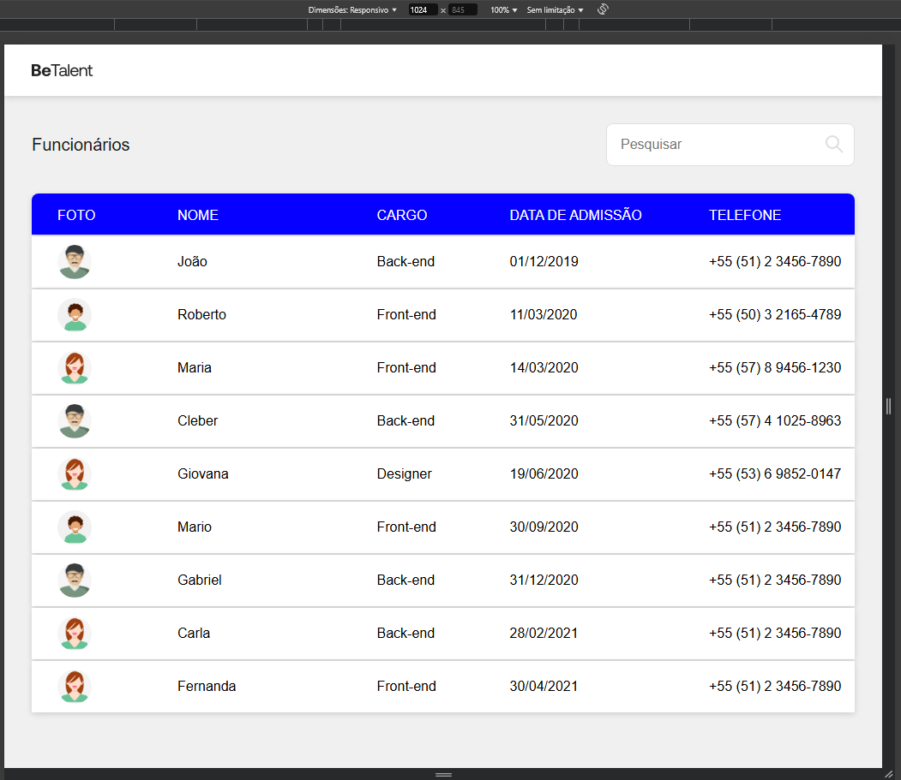
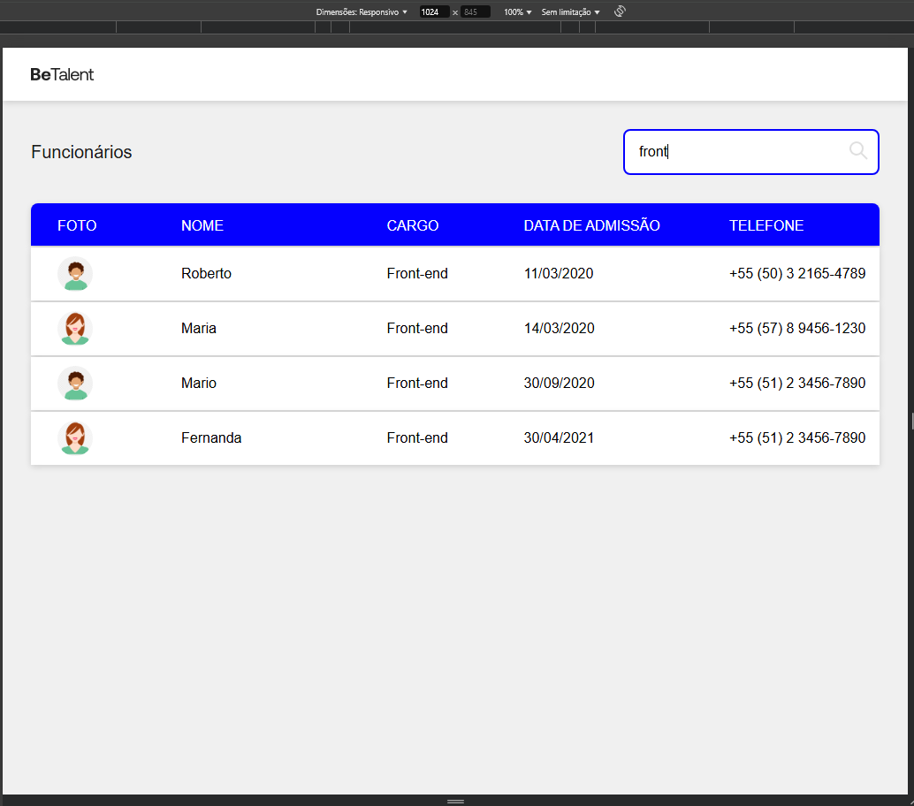
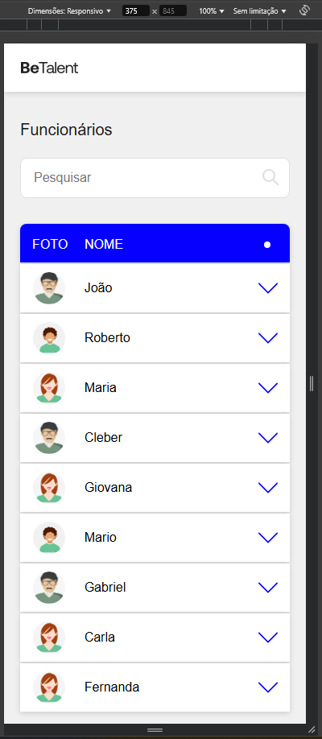
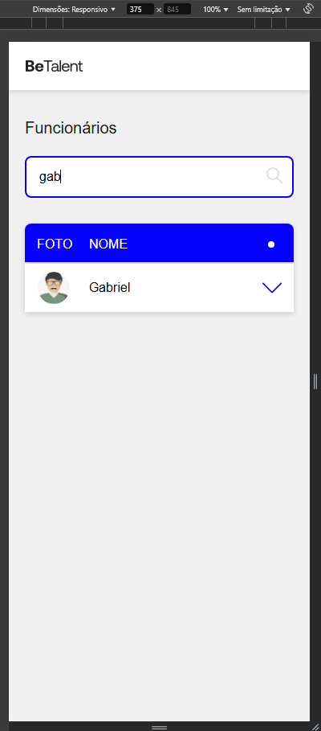
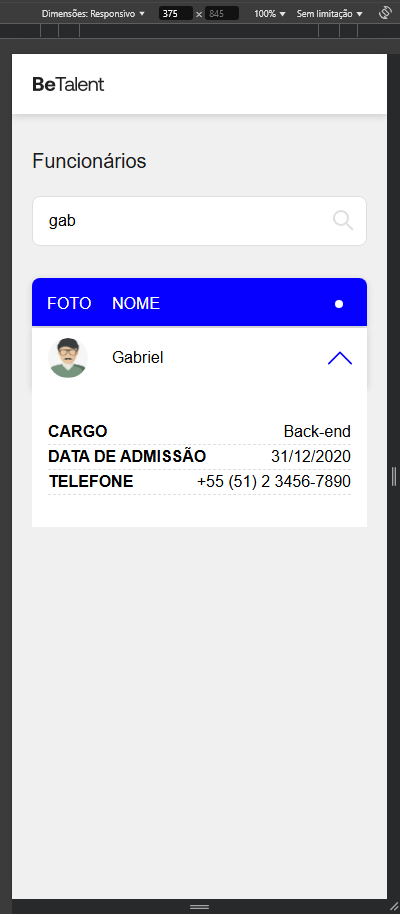
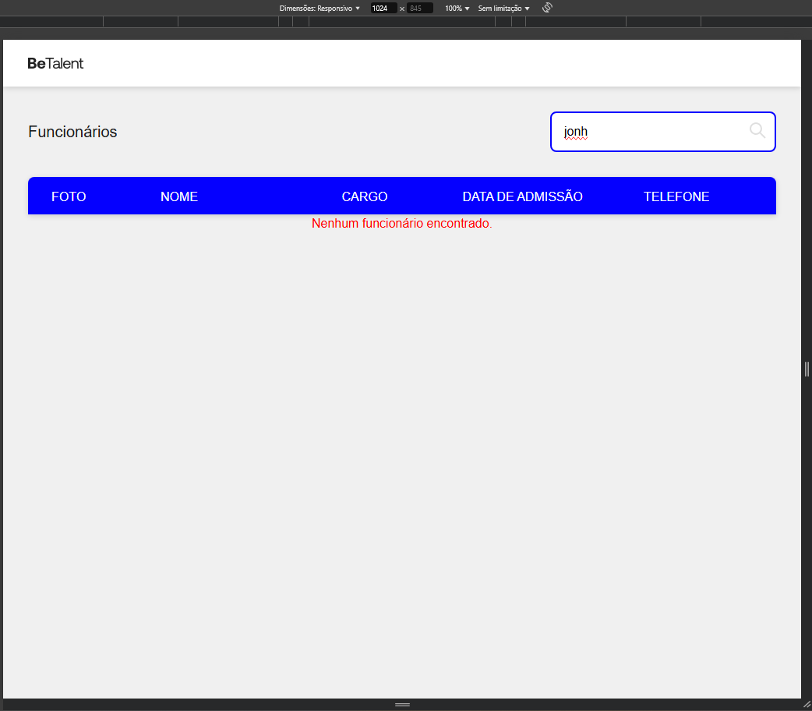
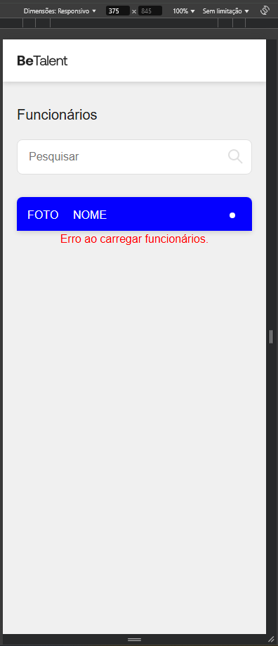

# Desafio Técnico Front-End BeTalent 💙

Este desafio consiste em desenvolver uma página onde é exibida uma tabela com dados como foto, nome, cargo, data de admissão e número de telefone de funcionários. Os dados extraídos são da API simulada.

## Funcionalidades
- Barra de pesquisa que filtra por nome, cargo e número de telefone;
- Formatação da data e do número de telefone.
- Layout totalmente responsivo (desktop e mobile).

## Responsividade mobile e desktop

### Desktop - width 1024px

 
 

### Mobile - width 375px
&nbsp;&nbsp;
&nbsp;&nbsp;
&nbsp;&nbsp;

### Mensagens de erro
#### Quando não há buscas correspondentes
&nbsp;&nbsp;
 

#### Quando ocorre erro ao buscar dados na API
&nbsp;&nbsp;

## Requisitos para rodar o projeto

- Node.js
- Yarn
- json-server

### Para rodar o projeto
1. Instale o node.js;
2. Clone este repositório [https://github.com/joycevaniasalvino/desafio-frontend-betalent.git](https://github.com/joycevaniasalvino/desafio-frontend-betalent.git);
3. Entre na pasta do projeto e execute no terminal o comando `yarn install` para instalar o Yarn;
4. Ainda no terminal, execute o comando `yarn` para instalar as dependências do projeto;
5. Por último, execute no terminal o comando `yarn start` para rodar o projeto;
6. Acesse o endpoint disponibilizado no terminal, caso não tenha aberto automaticamente, para visualizar o projeto deste desafio técnico.

### Para rodar a API simulada
1. Clone o repositório com os dados do desafio [https://github.com/BeMobile/desafio-front-end](https://github.com/BeMobile/desafio-front-end);
2. Entre na pasta do projeto e execute no terminal o comando `json-server --watch db.json`, caso não funcione com este comando, utilize `yarn json-server <path>/db.json`;
3. Acesse o endpoint disponibilizado no terminal para visualizar os dados diretamente na API.

Pronto! A API já está funcionando.

> **Atenção:** Caso o endpoint da API seja diferente de `http://localhost:3000`, altere a const `BASE_URL` no caminho `src/services/api.ts` para o link do endpoint que está rodando a API.

## Tecnologias utilizadas neste projeto

- TypeScript [https://www.typescriptlang.org/pt/docs/handbook/typescript-in-5-minutes.html](https://www.typescriptlang.org/pt/docs/handbook/typescript-in-5-minutes.html);
- React.js [https://pt-br.react.dev/](https://pt-br.react.dev/);
- Node.js [https://nodejs.org/pt](https://nodejs.org/pt);
- CSS [https://developer.mozilla.org/pt-BR/docs/Web/CSS](https://developer.mozilla.org/pt-BR/docs/Web/CSS);
- HTML [https://developer.mozilla.org/pt-BR/docs/Web/HTML](https://developer.mozilla.org/pt-BR/docs/Web/HTML);
- Yarn [https://classic.yarnpkg.com/lang/en/docs/](https://classic.yarnpkg.com/lang/en/docs/);
- Json-server [https://github.com/typicode/json-server](https://github.com/typicode/json-server);
- Git [https://git-scm.com/doc](https://git-scm.com/doc);
- GitHub [https://docs.github.com/pt/get-started](https://docs.github.com/pt/get-started).
 
 
<section align="center">
    &nbsp;&nbsp;&nbsp;
    &nbsp;&nbsp;&nbsp;
    &nbsp;&nbsp;&nbsp;
    &nbsp;&nbsp;&nbsp;
    &nbsp;&nbsp;&nbsp;
    &nbsp;&nbsp;&nbsp;
    &nbsp;&nbsp;&nbsp;
    &nbsp;&nbsp;&nbsp;
    
</section>
